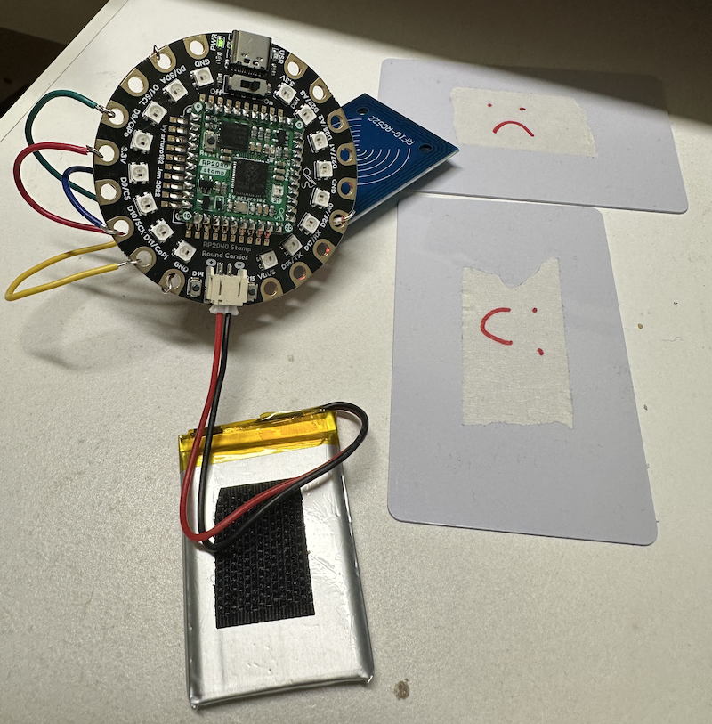

# RP2040 Mood Cards

This project was created as part of [CTC 28 - Connections](https://github.com/CodeTheCity/CTC28).

## What is it?

A simple device for indicating mood and if you want to be approached or not. The current mood is set using the relevant RFID card.

## Hardware

The project uses the following hardware:

* [RP2040 Stamp](https://www.solder.party/docs/rp2040-stamp/)
* [RP2040 Stamp Round Carrier](https://www.solder.party/docs/rp2040-stamp/round-carrier/)
* RFID RC522 Module
* RFID cards

## Resources

The project makes use of the following:

* [CircuitPython](https://learn.adafruit.com/welcome-to-circuitpython)

## Connecting the RC522 to the Carrier

| RC522 | Round Carrier |
| ----- | ------------- |
| 3.3v | 3.3v |
| RST | D26 |
| GND | GND |
| MISO | D8 |
| MOSI | D11 |
| SCK | D10 |
| SDA | D0 |